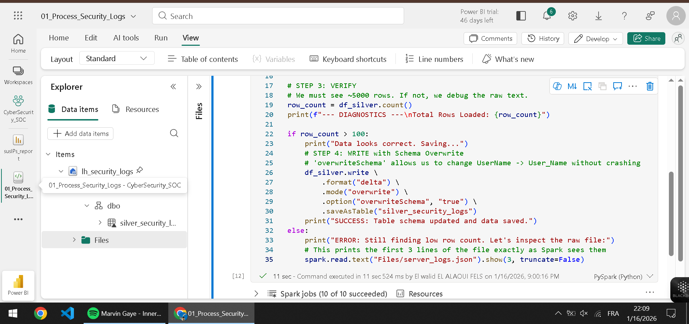
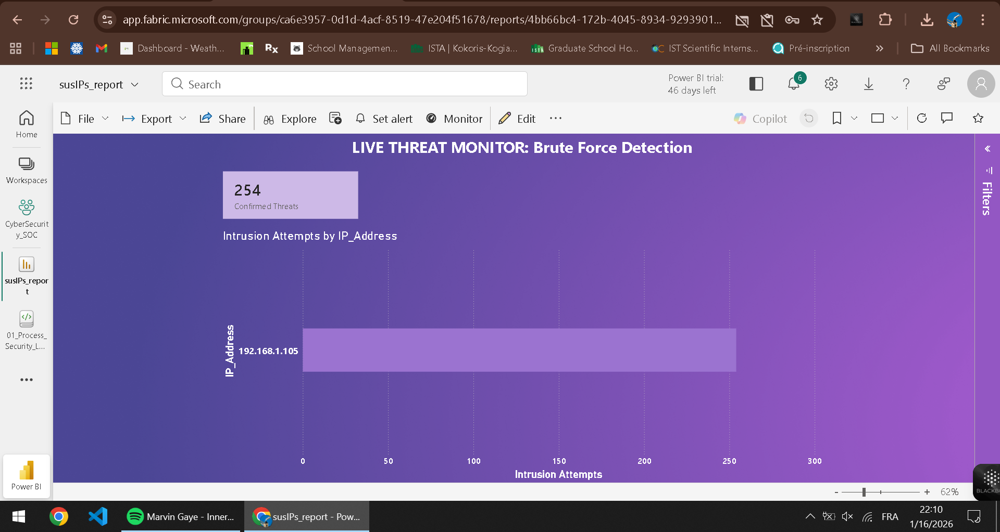

# 🛡️ Azure Fabric SIEM: Cybersecurity Log Analytics

### 🚀 Project Overview
This project simulates a **Security Operations Center (SOC)** pipeline. I built a cloud-native solution to detect "Brute Force" cyber attacks in real-time using **Microsoft Fabric**.

**The Challenge:** Ingest massive volumes of raw server logs, clean nested JSON data, and identify specific IP addresses attempting unauthorized access (Event ID 4625).

### 🏗️ Architecture
* **Source:** Python script simulating Windows Server Event Logs (JSON).
* **Ingestion (Bronze):** Azure OneLake (Lakehouse Architecture).
* **Transformation (Silver):** **PySpark** (Fabric Notebooks) for schema validation and flattening nested JSON.
* **Analysis (Gold):** **T-SQL** to aggregate failure counts and isolate attacker IPs.
* **Visualization:** **Power BI (Direct Lake)** for real-time threat monitoring.

### 📸 Project Screenshots

| 1. The Code (PySpark ETL) | 2. The Hunt (SQL Analysis) |
|:---:|:---:|
|  |  |

**3. The Commander's Dashboard**

### 💻 Key Technical Learnings
* **Schema Evolution:** Handled JSON schema changes using Delta Lake's `overwriteSchema` option.
* **Direct Lake Mode:** Implemented Power BI Direct Lake to eliminate import latency, allowing for near real-time security alerts.
* **Medallion Architecture:** Structured data into Bronze (Raw), Silver (Cleaned), and Gold (Aggregated) layers.

### 🛠️ How to Run
1.  Run `log_generator.py` to create the dummy dataset.
2.  Upload `server_logs.json` to a Fabric Lakehouse.
3.  Import the PySpark notebook and run the ETL pipeline.
